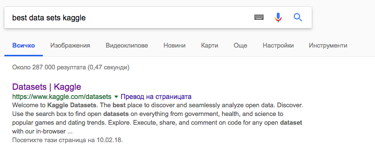
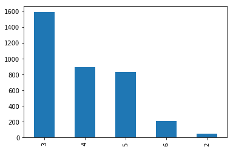

# Задача: 
Анализ с ML алгоритми на всякакви не комерсиални данни: публични данни, от е- правителство, научни данни, образование, здравеопазване и др. 


# Реализация: 
### Как започна всичко




Избрахме data set, сега да разгледаме какво съдържа...


Полетата в набора от данни включват:

<ul>
	<li>Ниво на удовлетвореност</li>
	<li>Последна оценка</li>
	<li>Брой проекти</li>
	<li>Средни месечни часове</li>
	<li>Времето, прекарано в компанията</li>
	<li>Дали са имали трудова злополука</li>
	<li>Дали са имали повишение през последните 5 години</li>
	<li>Отдел (column sales)</li>
	<li>Заплата</li>
	<li>Дали служителят е напуснал</li>
</ul>

<br>
<br>
<br>
За реализацията на проекта ще използвам python и блиблиотеки като pandas, nupy, sklearn и други
```
pip install numpy scipy matplotlib ipython scikit-learn pandas pillow mglearn jupyter
```


```python
import sys

import sklearn
import numpy as np
import matplotlib as mpl
import matplotlib.pyplot as plt
import pandas as pd
import mglearn
import seaborn as sns
from IPython.display import display
from sklearn.model_selection import train_test_split


%matplotlib inline
# pd.options.display.max_rows = 15
pd.options.mode.chained_assignment = None  # default='warn'
# pd.options.mode.chained_assignment = 'warn'  # default=
```

Нека да заредим данните и да ги разделим на train и validate множества


```python
data = pd.read_csv('HR_comma_sep.csv')
data_no_left = data.drop(labels=['left'], axis=1)
data_left = data['left']
x_train, x_val, y_train, y_val = train_test_split(data_no_left, data_left, test_size=0.15, random_state=4330)
print("Размери на всичките данни",data.shape)
print("Размери на train",x_train.shape)
print("Размери на validate",x_val.shape)
```

    Размери на всичките данни (14999, 10)
    Размери на train (12749, 9)
    Размери на validate (2250, 9)


За начало да видим колко време средно прекарват служителите в компанията


```python
data[data.left == True].time_spend_company.value_counts().plot(kind='bar');
```





Вижда се, че най-често хората напускат след 3-та си година в компанията


```python
data.dtypes[data.dtypes == 'object']
```


    sales     object
    salary    object
    dtype: object


```python
data.salary.value_counts().plot(kind='bar');
```


```python
data.sales.value_counts().plot(kind='bar');
```


Виждаме 2 категориини колони, които биха могли да направят проблем при по-нататъчна работа с данните. Ще направим One Hot Encoding


```python
encoded_x_train = x_train
encoded_x_train['low_salary'] = (x_train.salary == 'low').astype(float)
encoded_x_train['medium_salary'] = (x_train.salary == 'medium').astype(float)
encoded_x_train['high_salary'] = (x_train.salary == 'high').astype(float)
encoded_x_train = encoded_x_train.drop('salary', axis=1)

encoded_x_train['sales_sales'] = (x_train.sales == 'sales').astype(float)
encoded_x_train['technical_sales'] = (x_train.sales == 'technical').astype(float)
encoded_x_train['support_sales'] = (x_train.sales == 'support').astype(float)
encoded_x_train['IT_sales'] = (x_train.sales == 'IT').astype(float)
encoded_x_train['product_mng_sales'] = (x_train.sales == 'product_mng').astype(float)
encoded_x_train['marketing_sales'] = (x_train.sales == 'marketing_sales').astype(float)
encoded_x_train['RandD_sales'] = (x_train.sales == 'RandD').astype(float)
encoded_x_train['accounting_sales'] = (x_train.sales == 'accounting').astype(float)
encoded_x_train['hr_sales'] = (x_train.sales == 'hr').astype(float)
encoded_x_train['management_sales'] = (x_train.sales == 'management').astype(float)
encoded_x_train = encoded_x_train.drop('sales', axis=1)
```


```python
encoded_x_val = x_val
encoded_x_val['low_salary'] = (x_val.salary == 'low').astype(float)
encoded_x_val['medium_salary'] = (x_val.salary == 'medium').astype(float)
encoded_x_val['high_salary'] = (x_val.salary == 'high').astype(float)
encoded_x_val = encoded_x_val.drop('salary', axis=1)


encoded_x_val['sales_sales'] = (encoded_x_val.sales == 'sales').astype(float)
encoded_x_val['technical_sales'] = (encoded_x_val.sales == 'technical').astype(float)
encoded_x_val['support_sales'] = (encoded_x_val.sales == 'support').astype(float)
encoded_x_val['IT_sales'] = (encoded_x_val.sales == 'IT').astype(float)
encoded_x_val['product_mng_sales'] = (encoded_x_val.sales == 'product_mng').astype(float)
encoded_x_val['marketing_sales'] = (encoded_x_val.sales == 'marketing_sales').astype(float)
encoded_x_val['RandD_sales'] = (encoded_x_val.sales == 'RandD').astype(float)
encoded_x_val['accounting_sales'] = (encoded_x_val.sales == 'accounting').astype(float)
encoded_x_val['hr_sales'] = (encoded_x_val.sales == 'hr').astype(float)
encoded_x_val['management_sales'] = (encoded_x_val.sales == 'management').astype(float)
encoded_x_val = encoded_x_val.drop('sales', axis=1)
```


```python
encoded_x_train
```


<div>
<style>
    .dataframe thead tr:only-child th {
        text-align: right;
    }

    .dataframe thead th {
        text-align: left;
    }

    .dataframe tbody tr th {
        vertical-align: top;
    }
</style>
<table border="1" class="dataframe">
  <thead>
    <tr style="text-align: right;">
      <th></th>
      <th>satisfaction_level</th>
      <th>last_evaluation</th>
      <th>number_project</th>
      <th>average_montly_hours</th>
      <th>time_spend_company</th>
      <th>Work_accident</th>
      <th>promotion_last_5years</th>
      <th>low_salary</th>
      <th>medium_salary</th>
      <th>high_salary</th>
      <th>sales_sales</th>
      <th>technical_sales</th>
      <th>support_sales</th>
      <th>IT_sales</th>
      <th>product_mng_sales</th>
      <th>marketing_sales</th>
      <th>RandD_sales</th>
      <th>accounting_sales</th>
      <th>hr_sales</th>
      <th>management_sales</th>
    </tr>
  </thead>
  <tbody>
    <tr>
      <th>1397</th>
      <td>0.43</td>
      <td>0.53</td>
      <td>2</td>
      <td>146</td>
      <td>3</td>
      <td>0</td>
      <td>0</td>
      <td>0.0</td>
      <td>1.0</td>
      <td>0.0</td>
      <td>1.0</td>
      <td>0.0</td>
      <td>0.0</td>
      <td>0.0</td>
      <td>0.0</td>
      <td>0.0</td>
      <td>0.0</td>
      <td>0.0</td>
      <td>0.0</td>
      <td>0.0</td>
    </tr>
    <tr>
      <th>11702</th>
      <td>0.87</td>
      <td>0.90</td>
      <td>3</td>
      <td>174</td>
      <td>2</td>
      <td>0</td>
      <td>0</td>
      <td>1.0</td>
      <td>0.0</td>
      <td>0.0</td>
      <td>0.0</td>
      <td>0.0</td>
      <td>0.0</td>
      <td>1.0</td>
      <td>0.0</td>
      <td>0.0</td>
      <td>0.0</td>
      <td>0.0</td>
      <td>0.0</td>
      <td>0.0</td>
    </tr>
    <tr>
      <th>1485</th>
      <td>0.11</td>
      <td>0.88</td>
      <td>7</td>
      <td>253</td>
      <td>4</td>
      <td>0</td>
      <td>0</td>
      <td>1.0</td>
      <td>0.0</td>
      <td>0.0</td>
      <td>0.0</td>
      <td>0.0</td>
      <td>0.0</td>
      <td>0.0</td>
      <td>0.0</td>
      <td>0.0</td>
      <td>0.0</td>
      <td>0.0</td>
      <td>1.0</td>
      <td>0.0</td>
    </tr>
    <tr>
      <th>10061</th>
      <td>0.96</td>
      <td>0.95</td>
      <td>6</td>
      <td>215</td>
      <td>4</td>
      <td>0</td>
      <td>0</td>
      <td>1.0</td>
      <td>0.0</td>
      <td>0.0</td>
      <td>0.0</td>
      <td>0.0</td>
      <td>0.0</td>
      <td>1.0</td>
      <td>0.0</td>
      <td>0.0</td>
      <td>0.0</td>
      <td>0.0</td>
      <td>0.0</td>
      <td>0.0</td>
    </tr>
    <tr>
      <th>7964</th>
      <td>0.91</td>
      <td>0.61</td>
      <td>3</td>
      <td>255</td>
      <td>3</td>
      <td>0</td>
      <td>0</td>
      <td>0.0</td>
      <td>1.0</td>
      <td>0.0</td>
      <td>0.0</td>
      <td>0.0</td>
      <td>0.0</td>
      <td>0.0</td>
      <td>0.0</td>
      <td>0.0</td>
      <td>0.0</td>
      <td>1.0</td>
      <td>0.0</td>
      <td>0.0</td>
    </tr>
    <tr>
      <th>10843</th>
      <td>0.95</td>
      <td>0.62</td>
      <td>4</td>
      <td>150</td>
      <td>2</td>
      <td>0</td>
      <td>0</td>
      <td>1.0</td>
      <td>0.0</td>
      <td>0.0</td>
      <td>0.0</td>
      <td>0.0</td>
      <td>0.0</td>
      <td>0.0</td>
      <td>0.0</td>
      <td>0.0</td>
      <td>0.0</td>
      <td>0.0</td>
      <td>0.0</td>
      <td>1.0</td>
    </tr>
    <tr>
      <th>14787</th>
      <td>0.48</td>
      <td>0.78</td>
      <td>2</td>
      <td>198</td>
      <td>2</td>
      <td>0</td>
      <td>0</td>
      <td>0.0</td>
      <td>1.0</td>
      <td>0.0</td>
      <td>0.0</td>
      <td>1.0</td>
      <td>0.0</td>
      <td>0.0</td>
      <td>0.0</td>
      <td>0.0</td>
      <td>0.0</td>
      <td>0.0</td>
      <td>0.0</td>
      <td>0.0</td>
    </tr>
    <tr>
      <th>5527</th>
      <td>0.61</td>
      <td>0.61</td>
      <td>4</td>
      <td>239</td>
      <td>2</td>
      <td>0</td>
      <td>1</td>
      <td>0.0</td>
      <td>0.0</td>
      <td>1.0</td>
      <td>0.0</td>
      <td>0.0</td>
      <td>0.0</td>
      <td>0.0</td>
      <td>0.0</td>
      <td>0.0</td>
      <td>0.0</td>
      <td>0.0</td>
      <td>1.0</td>
      <td>0.0</td>
    </tr>
    <tr>
      <th>3459</th>
      <td>0.63</td>
      <td>0.62</td>
      <td>5</td>
      <td>212</td>
      <td>6</td>
      <td>0</td>
      <td>0</td>
      <td>0.0</td>
      <td>1.0</td>
      <td>0.0</td>
      <td>1.0</td>
      <td>0.0</td>
      <td>0.0</td>
      <td>0.0</td>
      <td>0.0</td>
      <td>0.0</td>
      <td>0.0</td>
      <td>0.0</td>
      <td>0.0</td>
      <td>0.0</td>
    </tr>
    <tr>
      <th>9302</th>
      <td>0.76</td>
      <td>0.80</td>
      <td>3</td>
      <td>202</td>
      <td>3</td>
      <td>0</td>
      <td>0</td>
      <td>0.0</td>
      <td>1.0</td>
      <td>0.0</td>
      <td>0.0</td>
      <td>0.0</td>
      <td>0.0</td>
      <td>0.0</td>
      <td>1.0</td>
      <td>0.0</td>
      <td>0.0</td>
      <td>0.0</td>
      <td>0.0</td>
      <td>0.0</td>
    </tr>
    <tr>
      <th>13500</th>
      <td>0.98</td>
      <td>0.55</td>
      <td>3</td>
      <td>166</td>
      <td>6</td>
      <td>1</td>
      <td>0</td>
      <td>0.0</td>
      <td>1.0</td>
      <td>0.0</td>
      <td>1.0</td>
      <td>0.0</td>
      <td>0.0</td>
      <td>0.0</td>
      <td>0.0</td>
      <td>0.0</td>
      <td>0.0</td>
      <td>0.0</td>
      <td>0.0</td>
      <td>0.0</td>
    </tr>
    <tr>
      <th>13358</th>
      <td>0.57</td>
      <td>0.59</td>
      <td>4</td>
      <td>250</td>
      <td>2</td>
      <td>0</td>
      <td>0</td>
      <td>1.0</td>
      <td>0.0</td>
      <td>0.0</td>
      <td>0.0</td>
      <td>0.0</td>
      <td>1.0</td>
      <td>0.0</td>
      <td>0.0</td>
      <td>0.0</td>
      <td>0.0</td>
      <td>0.0</td>
      <td>0.0</td>
      <td>0.0</td>
    </tr>
    <tr>
      <th>8259</th>
      <td>0.94</td>
      <td>0.78</td>
      <td>3</td>
      <td>218</td>
      <td>2</td>
      <td>1</td>
      <td>0</td>
      <td>0.0</td>
      <td>1.0</td>
      <td>0.0</td>
      <td>1.0</td>
      <td>0.0</td>
      <td>0.0</td>
      <td>0.0</td>
      <td>0.0</td>
      <td>0.0</td>
      <td>0.0</td>
      <td>0.0</td>
      <td>0.0</td>
      <td>0.0</td>
    </tr>
    <tr>
      <th>10809</th>
      <td>0.51</td>
      <td>0.74</td>
      <td>6</td>
      <td>98</td>
      <td>3</td>
      <td>0</td>
      <td>0</td>
      <td>1.0</td>
      <td>0.0</td>
      <td>0.0</td>
      <td>0.0</td>
      <td>0.0</td>
      <td>1.0</td>
      <td>0.0</td>
      <td>0.0</td>
      <td>0.0</td>
      <td>0.0</td>
      <td>0.0</td>
      <td>0.0</td>
      <td>0.0</td>
    </tr>
    <tr>
      <th>6192</th>
      <td>0.98</td>
      <td>0.63</td>
      <td>3</td>
      <td>135</td>
      <td>3</td>
      <td>0</td>
      <td>0</td>
      <td>1.0</td>
      <td>0.0</td>
      <td>0.0</td>
      <td>1.0</td>
      <td>0.0</td>
      <td>0.0</td>
      <td>0.0</td>
      <td>0.0</td>
      <td>0.0</td>
      <td>0.0</td>
      <td>0.0</td>
      <td>0.0</td>
      <td>0.0</td>
    </tr>
    <tr>
      <th>4933</th>
      <td>0.96</td>
      <td>0.93</td>
      <td>4</td>
      <td>260</td>
      <td>3</td>
      <td>0</td>
      <td>0</td>
      <td>0.0</td>
      <td>1.0</td>
      <td>0.0</td>
      <td>0.0</td>
      <td>0.0</td>
      <td>1.0</td>
      <td>0.0</td>
      <td>0.0</td>
      <td>0.0</td>
      <td>0.0</td>
      <td>0.0</td>
      <td>0.0</td>
      <td>0.0</td>
    </tr>
    <tr>
      <th>2249</th>
      <td>0.90</td>
      <td>0.48</td>
      <td>4</td>
      <td>204</td>
      <td>3</td>
      <td>0</td>
      <td>0</td>
      <td>0.0</td>
      <td>1.0</td>
      <td>0.0</td>
      <td>0.0</td>
      <td>1.0</td>
      <td>0.0</td>
      <td>0.0</td>
      <td>0.0</td>
      <td>0.0</td>
      <td>0.0</td>
      <td>0.0</td>
      <td>0.0</td>
      <td>0.0</td>
    </tr>
    <tr>
      <th>149</th>
      <td>0.39</td>
      <td>0.50</td>
      <td>2</td>
      <td>147</td>
      <td>3</td>
      <td>0</td>
      <td>0</td>
      <td>1.0</td>
      <td>0.0</td>
      <td>0.0</td>
      <td>0.0</td>
      <td>0.0</td>
      <td>0.0</td>
      <td>0.0</td>
      <td>0.0</td>
      <td>0.0</td>
      <td>0.0</td>
      <td>0.0</td>
      <td>0.0</td>
      <td>0.0</td>
    </tr>
    <tr>
      <th>8609</th>
      <td>0.58</td>
      <td>0.60</td>
      <td>4</td>
      <td>147</td>
      <td>3</td>
      <td>0</td>
      <td>0</td>
      <td>0.0</td>
      <td>1.0</td>
      <td>0.0</td>
      <td>0.0</td>
      <td>1.0</td>
      <td>0.0</td>
      <td>0.0</td>
      <td>0.0</td>
      <td>0.0</td>
      <td>0.0</td>
      <td>0.0</td>
      <td>0.0</td>
      <td>0.0</td>
    </tr>
    <tr>
      <th>10846</th>
      <td>0.48</td>
      <td>0.51</td>
      <td>3</td>
      <td>136</td>
      <td>3</td>
      <td>0</td>
      <td>0</td>
      <td>1.0</td>
      <td>0.0</td>
      <td>0.0</td>
      <td>0.0</td>
      <td>0.0</td>
      <td>0.0</td>
      <td>0.0</td>
      <td>0.0</td>
      <td>0.0</td>
      <td>0.0</td>
      <td>0.0</td>
      <td>0.0</td>
      <td>0.0</td>
    </tr>
    <tr>
      <th>10811</th>
      <td>0.97</td>
      <td>0.93</td>
      <td>5</td>
      <td>137</td>
      <td>2</td>
      <td>1</td>
      <td>0</td>
      <td>1.0</td>
      <td>0.0</td>
      <td>0.0</td>
      <td>0.0</td>
      <td>0.0</td>
      <td>1.0</td>
      <td>0.0</td>
      <td>0.0</td>
      <td>0.0</td>
      <td>0.0</td>
      <td>0.0</td>
      <td>0.0</td>
      <td>0.0</td>
    </tr>
    <tr>
      <th>6017</th>
      <td>0.82</td>
      <td>0.59</td>
      <td>3</td>
      <td>178</td>
      <td>2</td>
      <td>0</td>
      <td>0</td>
      <td>0.0</td>
      <td>1.0</td>
      <td>0.0</td>
      <td>0.0</td>
      <td>0.0</td>
      <td>0.0</td>
      <td>1.0</td>
      <td>0.0</td>
      <td>0.0</td>
      <td>0.0</td>
      <td>0.0</td>
      <td>0.0</td>
      <td>0.0</td>
    </tr>
    <tr>
      <th>1666</th>
      <td>0.41</td>
      <td>0.51</td>
      <td>2</td>
      <td>159</td>
      <td>3</td>
      <td>0</td>
      <td>0</td>
      <td>0.0</td>
      <td>1.0</td>
      <td>0.0</td>
      <td>0.0</td>
      <td>0.0</td>
      <td>0.0</td>
      <td>1.0</td>
      <td>0.0</td>
      <td>0.0</td>
      <td>0.0</td>
      <td>0.0</td>
      <td>0.0</td>
      <td>0.0</td>
    </tr>
    <tr>
      <th>3712</th>
      <td>0.94</td>
      <td>0.95</td>
      <td>4</td>
      <td>155</td>
      <td>3</td>
      <td>0</td>
      <td>0</td>
      <td>0.0</td>
      <td>1.0</td>
      <td>0.0</td>
      <td>0.0</td>
      <td>0.0</td>
      <td>1.0</td>
      <td>0.0</td>
      <td>0.0</td>
      <td>0.0</td>
      <td>0.0</td>
      <td>0.0</td>
      <td>0.0</td>
      <td>0.0</td>
    </tr>
    <tr>
      <th>1760</th>
      <td>0.37</td>
      <td>0.55</td>
      <td>2</td>
      <td>140</td>
      <td>3</td>
      <td>0</td>
      <td>0</td>
      <td>1.0</td>
      <td>0.0</td>
      <td>0.0</td>
      <td>0.0</td>
      <td>1.0</td>
      <td>0.0</td>
      <td>0.0</td>
      <td>0.0</td>
      <td>0.0</td>
      <td>0.0</td>
      <td>0.0</td>
      <td>0.0</td>
      <td>0.0</td>
    </tr>
    <tr>
      <th>3276</th>
      <td>0.93</td>
      <td>0.65</td>
      <td>4</td>
      <td>212</td>
      <td>4</td>
      <td>0</td>
      <td>0</td>
      <td>0.0</td>
      <td>1.0</td>
      <td>0.0</td>
      <td>0.0</td>
      <td>0.0</td>
      <td>0.0</td>
      <td>1.0</td>
      <td>0.0</td>
      <td>0.0</td>
      <td>0.0</td>
      <td>0.0</td>
      <td>0.0</td>
      <td>0.0</td>
    </tr>
    <tr>
      <th>6002</th>
      <td>0.79</td>
      <td>0.86</td>
      <td>3</td>
      <td>126</td>
      <td>5</td>
      <td>0</td>
      <td>0</td>
      <td>1.0</td>
      <td>0.0</td>
      <td>0.0</td>
      <td>0.0</td>
      <td>0.0</td>
      <td>1.0</td>
      <td>0.0</td>
      <td>0.0</td>
      <td>0.0</td>
      <td>0.0</td>
      <td>0.0</td>
      <td>0.0</td>
      <td>0.0</td>
    </tr>
    <tr>
      <th>8356</th>
      <td>0.95</td>
      <td>0.43</td>
      <td>6</td>
      <td>283</td>
      <td>2</td>
      <td>0</td>
      <td>0</td>
      <td>1.0</td>
      <td>0.0</td>
      <td>0.0</td>
      <td>0.0</td>
      <td>1.0</td>
      <td>0.0</td>
      <td>0.0</td>
      <td>0.0</td>
      <td>0.0</td>
      <td>0.0</td>
      <td>0.0</td>
      <td>0.0</td>
      <td>0.0</td>
    </tr>
    <tr>
      <th>4451</th>
      <td>0.87</td>
      <td>0.68</td>
      <td>5</td>
      <td>187</td>
      <td>3</td>
      <td>0</td>
      <td>0</td>
      <td>1.0</td>
      <td>0.0</td>
      <td>0.0</td>
      <td>1.0</td>
      <td>0.0</td>
      <td>0.0</td>
      <td>0.0</td>
      <td>0.0</td>
      <td>0.0</td>
      <td>0.0</td>
      <td>0.0</td>
      <td>0.0</td>
      <td>0.0</td>
    </tr>
    <tr>
      <th>10743</th>
      <td>0.61</td>
      <td>0.73</td>
      <td>3</td>
      <td>252</td>
      <td>3</td>
      <td>0</td>
      <td>0</td>
      <td>0.0</td>
      <td>0.0</td>
      <td>1.0</td>
      <td>0.0</td>
      <td>1.0</td>
      <td>0.0</td>
      <td>0.0</td>
      <td>0.0</td>
      <td>0.0</td>
      <td>0.0</td>
      <td>0.0</td>
      <td>0.0</td>
      <td>0.0</td>
    </tr>
    <tr>
      <th>...</th>
      <td>...</td>
      <td>...</td>
      <td>...</td>
      <td>...</td>
      <td>...</td>
      <td>...</td>
      <td>...</td>
      <td>...</td>
      <td>...</td>
      <td>...</td>
      <td>...</td>
      <td>...</td>
      <td>...</td>
      <td>...</td>
      <td>...</td>
      <td>...</td>
      <td>...</td>
      <td>...</td>
      <td>...</td>
      <td>...</td>
    </tr>
    <tr>
      <th>4020</th>
      <td>0.83</td>
      <td>0.69</td>
      <td>4</td>
      <td>151</td>
      <td>2</td>
      <td>0</td>
      <td>0</td>
      <td>1.0</td>
      <td>0.0</td>
      <td>0.0</td>
      <td>0.0</td>
      <td>0.0</td>
      <td>1.0</td>
      <td>0.0</td>
      <td>0.0</td>
      <td>0.0</td>
      <td>0.0</td>
      <td>0.0</td>
      <td>0.0</td>
      <td>0.0</td>
    </tr>
    <tr>
      <th>3335</th>
      <td>0.74</td>
      <td>0.85</td>
      <td>5</td>
      <td>135</td>
      <td>2</td>
      <td>0</td>
      <td>0</td>
      <td>1.0</td>
      <td>0.0</td>
      <td>0.0</td>
      <td>0.0</td>
      <td>0.0</td>
      <td>1.0</td>
      <td>0.0</td>
      <td>0.0</td>
      <td>0.0</td>
      <td>0.0</td>
      <td>0.0</td>
      <td>0.0</td>
      <td>0.0</td>
    </tr>
    <tr>
      <th>1519</th>
      <td>0.40</td>
      <td>0.55</td>
      <td>2</td>
      <td>131</td>
      <td>3</td>
      <td>0</td>
      <td>0</td>
      <td>0.0</td>
      <td>1.0</td>
      <td>0.0</td>
      <td>0.0</td>
      <td>0.0</td>
      <td>0.0</td>
      <td>0.0</td>
      <td>1.0</td>
      <td>0.0</td>
      <td>0.0</td>
      <td>0.0</td>
      <td>0.0</td>
      <td>0.0</td>
    </tr>
    <tr>
      <th>2329</th>
      <td>0.66</td>
      <td>0.77</td>
      <td>2</td>
      <td>171</td>
      <td>2</td>
      <td>0</td>
      <td>0</td>
      <td>0.0</td>
      <td>1.0</td>
      <td>0.0</td>
      <td>0.0</td>
      <td>1.0</td>
      <td>0.0</td>
      <td>0.0</td>
      <td>0.0</td>
      <td>0.0</td>
      <td>0.0</td>
      <td>0.0</td>
      <td>0.0</td>
      <td>0.0</td>
    </tr>
    <tr>
      <th>5130</th>
      <td>0.49</td>
      <td>0.54</td>
      <td>6</td>
      <td>214</td>
      <td>3</td>
      <td>0</td>
      <td>0</td>
      <td>0.0</td>
      <td>0.0</td>
      <td>1.0</td>
      <td>1.0</td>
      <td>0.0</td>
      <td>0.0</td>
      <td>0.0</td>
      <td>0.0</td>
      <td>0.0</td>
      <td>0.0</td>
      <td>0.0</td>
      <td>0.0</td>
      <td>0.0</td>
    </tr>
    <tr>
      <th>9009</th>
      <td>0.86</td>
      <td>0.85</td>
      <td>2</td>
      <td>195</td>
      <td>4</td>
      <td>0</td>
      <td>0</td>
      <td>0.0</td>
      <td>1.0</td>
      <td>0.0</td>
      <td>0.0</td>
      <td>0.0</td>
      <td>1.0</td>
      <td>0.0</td>
      <td>0.0</td>
      <td>0.0</td>
      <td>0.0</td>
      <td>0.0</td>
      <td>0.0</td>
      <td>0.0</td>
    </tr>
    <tr>
      <th>7723</th>
      <td>1.00</td>
      <td>0.84</td>
      <td>3</td>
      <td>215</td>
      <td>2</td>
      <td>0</td>
      <td>0</td>
      <td>0.0</td>
      <td>1.0</td>
      <td>0.0</td>
      <td>1.0</td>
      <td>0.0</td>
      <td>0.0</td>
      <td>0.0</td>
      <td>0.0</td>
      <td>0.0</td>
      <td>0.0</td>
      <td>0.0</td>
      <td>0.0</td>
      <td>0.0</td>
    </tr>
    <tr>
      <th>7815</th>
      <td>0.98</td>
      <td>0.69</td>
      <td>3</td>
      <td>274</td>
      <td>3</td>
      <td>0</td>
      <td>0</td>
      <td>1.0</td>
      <td>0.0</td>
      <td>0.0</td>
      <td>0.0</td>
      <td>0.0</td>
      <td>0.0</td>
      <td>0.0</td>
      <td>0.0</td>
      <td>0.0</td>
      <td>0.0</td>
      <td>0.0</td>
      <td>1.0</td>
      <td>0.0</td>
    </tr>
    <tr>
      <th>13293</th>
      <td>0.74</td>
      <td>0.73</td>
      <td>3</td>
      <td>156</td>
      <td>8</td>
      <td>0</td>
      <td>0</td>
      <td>0.0</td>
      <td>1.0</td>
      <td>0.0</td>
      <td>0.0</td>
      <td>0.0</td>
      <td>0.0</td>
      <td>0.0</td>
      <td>0.0</td>
      <td>0.0</td>
      <td>0.0</td>
      <td>0.0</td>
      <td>0.0</td>
      <td>1.0</td>
    </tr>
    <tr>
      <th>7761</th>
      <td>0.49</td>
      <td>0.79</td>
      <td>5</td>
      <td>206</td>
      <td>2</td>
      <td>0</td>
      <td>0</td>
      <td>0.0</td>
      <td>1.0</td>
      <td>0.0</td>
      <td>0.0</td>
      <td>0.0</td>
      <td>1.0</td>
      <td>0.0</td>
      <td>0.0</td>
      <td>0.0</td>
      <td>0.0</td>
      <td>0.0</td>
      <td>0.0</td>
      <td>0.0</td>
    </tr>
    <tr>
      <th>4865</th>
      <td>0.85</td>
      <td>0.79</td>
      <td>3</td>
      <td>217</td>
      <td>2</td>
      <td>0</td>
      <td>0</td>
      <td>0.0</td>
      <td>1.0</td>
      <td>0.0</td>
      <td>0.0</td>
      <td>1.0</td>
      <td>0.0</td>
      <td>0.0</td>
      <td>0.0</td>
      <td>0.0</td>
      <td>0.0</td>
      <td>0.0</td>
      <td>0.0</td>
      <td>0.0</td>
    </tr>
    <tr>
      <th>10676</th>
      <td>0.96</td>
      <td>0.70</td>
      <td>4</td>
      <td>272</td>
      <td>3</td>
      <td>0</td>
      <td>0</td>
      <td>0.0</td>
      <td>0.0</td>
      <td>1.0</td>
      <td>0.0</td>
      <td>0.0</td>
      <td>0.0</td>
      <td>0.0</td>
      <td>1.0</td>
      <td>0.0</td>
      <td>0.0</td>
      <td>0.0</td>
      <td>0.0</td>
      <td>0.0</td>
    </tr>
    <tr>
      <th>13092</th>
      <td>0.50</td>
      <td>0.95</td>
      <td>5</td>
      <td>137</td>
      <td>3</td>
      <td>0</td>
      <td>0</td>
      <td>1.0</td>
      <td>0.0</td>
      <td>0.0</td>
      <td>0.0</td>
      <td>1.0</td>
      <td>0.0</td>
      <td>0.0</td>
      <td>0.0</td>
      <td>0.0</td>
      <td>0.0</td>
      <td>0.0</td>
      <td>0.0</td>
      <td>0.0</td>
    </tr>
    <tr>
      <th>2957</th>
      <td>0.75</td>
      <td>0.70</td>
      <td>5</td>
      <td>269</td>
      <td>3</td>
      <td>0</td>
      <td>0</td>
      <td>0.0</td>
      <td>1.0</td>
      <td>0.0</td>
      <td>0.0</td>
      <td>0.0</td>
      <td>1.0</td>
      <td>0.0</td>
      <td>0.0</td>
      <td>0.0</td>
      <td>0.0</td>
      <td>0.0</td>
      <td>0.0</td>
      <td>0.0</td>
    </tr>
    <tr>
      <th>13957</th>
      <td>0.67</td>
      <td>0.49</td>
      <td>3</td>
      <td>247</td>
      <td>10</td>
      <td>0</td>
      <td>0</td>
      <td>0.0</td>
      <td>1.0</td>
      <td>0.0</td>
      <td>1.0</td>
      <td>0.0</td>
      <td>0.0</td>
      <td>0.0</td>
      <td>0.0</td>
      <td>0.0</td>
      <td>0.0</td>
      <td>0.0</td>
      <td>0.0</td>
      <td>0.0</td>
    </tr>
    <tr>
      <th>6811</th>
      <td>0.32</td>
      <td>0.45</td>
      <td>2</td>
      <td>188</td>
      <td>3</td>
      <td>0</td>
      <td>0</td>
      <td>1.0</td>
      <td>0.0</td>
      <td>0.0</td>
      <td>1.0</td>
      <td>0.0</td>
      <td>0.0</td>
      <td>0.0</td>
      <td>0.0</td>
      <td>0.0</td>
      <td>0.0</td>
      <td>0.0</td>
      <td>0.0</td>
      <td>0.0</td>
    </tr>
    <tr>
      <th>13584</th>
      <td>0.42</td>
      <td>0.45</td>
      <td>3</td>
      <td>227</td>
      <td>3</td>
      <td>0</td>
      <td>0</td>
      <td>0.0</td>
      <td>1.0</td>
      <td>0.0</td>
      <td>1.0</td>
      <td>0.0</td>
      <td>0.0</td>
      <td>0.0</td>
      <td>0.0</td>
      <td>0.0</td>
      <td>0.0</td>
      <td>0.0</td>
      <td>0.0</td>
      <td>0.0</td>
    </tr>
    <tr>
      <th>759</th>
      <td>0.41</td>
      <td>0.55</td>
      <td>2</td>
      <td>151</td>
      <td>3</td>
      <td>0</td>
      <td>0</td>
      <td>1.0</td>
      <td>0.0</td>
      <td>0.0</td>
      <td>1.0</td>
      <td>0.0</td>
      <td>0.0</td>
      <td>0.0</td>
      <td>0.0</td>
      <td>0.0</td>
      <td>0.0</td>
      <td>0.0</td>
      <td>0.0</td>
      <td>0.0</td>
    </tr>
    <tr>
      <th>8363</th>
      <td>0.12</td>
      <td>0.59</td>
      <td>3</td>
      <td>229</td>
      <td>6</td>
      <td>0</td>
      <td>0</td>
      <td>0.0</td>
      <td>1.0</td>
      <td>0.0</td>
      <td>0.0</td>
      <td>1.0</td>
      <td>0.0</td>
      <td>0.0</td>
      <td>0.0</td>
      <td>0.0</td>
      <td>0.0</td>
      <td>0.0</td>
      <td>0.0</td>
      <td>0.0</td>
    </tr>
    <tr>
      <th>6922</th>
      <td>0.48</td>
      <td>0.41</td>
      <td>5</td>
      <td>286</td>
      <td>3</td>
      <td>0</td>
      <td>0</td>
      <td>0.0</td>
      <td>0.0</td>
      <td>1.0</td>
      <td>0.0</td>
      <td>0.0</td>
      <td>1.0</td>
      <td>0.0</td>
      <td>0.0</td>
      <td>0.0</td>
      <td>0.0</td>
      <td>0.0</td>
      <td>0.0</td>
      <td>0.0</td>
    </tr>
    <tr>
      <th>735</th>
      <td>0.83</td>
      <td>0.99</td>
      <td>5</td>
      <td>258</td>
      <td>5</td>
      <td>0</td>
      <td>0</td>
      <td>0.0</td>
      <td>0.0</td>
      <td>1.0</td>
      <td>0.0</td>
      <td>0.0</td>
      <td>1.0</td>
      <td>0.0</td>
      <td>0.0</td>
      <td>0.0</td>
      <td>0.0</td>
      <td>0.0</td>
      <td>0.0</td>
      <td>0.0</td>
    </tr>
    <tr>
      <th>3828</th>
      <td>0.58</td>
      <td>0.79</td>
      <td>5</td>
      <td>262</td>
      <td>2</td>
      <td>0</td>
      <td>0</td>
      <td>0.0</td>
      <td>0.0</td>
      <td>1.0</td>
      <td>1.0</td>
      <td>0.0</td>
      <td>0.0</td>
      <td>0.0</td>
      <td>0.0</td>
      <td>0.0</td>
      <td>0.0</td>
      <td>0.0</td>
      <td>0.0</td>
      <td>0.0</td>
    </tr>
    <tr>
      <th>9559</th>
      <td>0.15</td>
      <td>0.95</td>
      <td>4</td>
      <td>173</td>
      <td>5</td>
      <td>1</td>
      <td>0</td>
      <td>1.0</td>
      <td>0.0</td>
      <td>0.0</td>
      <td>1.0</td>
      <td>0.0</td>
      <td>0.0</td>
      <td>0.0</td>
      <td>0.0</td>
      <td>0.0</td>
      <td>0.0</td>
      <td>0.0</td>
      <td>0.0</td>
      <td>0.0</td>
    </tr>
    <tr>
      <th>11400</th>
      <td>0.15</td>
      <td>0.75</td>
      <td>3</td>
      <td>150</td>
      <td>4</td>
      <td>0</td>
      <td>1</td>
      <td>0.0</td>
      <td>1.0</td>
      <td>0.0</td>
      <td>0.0</td>
      <td>0.0</td>
      <td>0.0</td>
      <td>0.0</td>
      <td>0.0</td>
      <td>0.0</td>
      <td>0.0</td>
      <td>1.0</td>
      <td>0.0</td>
      <td>0.0</td>
    </tr>
    <tr>
      <th>7002</th>
      <td>0.68</td>
      <td>0.75</td>
      <td>5</td>
      <td>243</td>
      <td>3</td>
      <td>1</td>
      <td>0</td>
      <td>1.0</td>
      <td>0.0</td>
      <td>0.0</td>
      <td>0.0</td>
      <td>0.0</td>
      <td>1.0</td>
      <td>0.0</td>
      <td>0.0</td>
      <td>0.0</td>
      <td>0.0</td>
      <td>0.0</td>
      <td>0.0</td>
      <td>0.0</td>
    </tr>
    <tr>
      <th>3611</th>
      <td>0.60</td>
      <td>0.99</td>
      <td>4</td>
      <td>225</td>
      <td>3</td>
      <td>0</td>
      <td>0</td>
      <td>0.0</td>
      <td>1.0</td>
      <td>0.0</td>
      <td>1.0</td>
      <td>0.0</td>
      <td>0.0</td>
      <td>0.0</td>
      <td>0.0</td>
      <td>0.0</td>
      <td>0.0</td>
      <td>0.0</td>
      <td>0.0</td>
      <td>0.0</td>
    </tr>
    <tr>
      <th>8987</th>
      <td>0.89</td>
      <td>1.00</td>
      <td>4</td>
      <td>226</td>
      <td>2</td>
      <td>1</td>
      <td>0</td>
      <td>1.0</td>
      <td>0.0</td>
      <td>0.0</td>
      <td>0.0</td>
      <td>1.0</td>
      <td>0.0</td>
      <td>0.0</td>
      <td>0.0</td>
      <td>0.0</td>
      <td>0.0</td>
      <td>0.0</td>
      <td>0.0</td>
      <td>0.0</td>
    </tr>
    <tr>
      <th>831</th>
      <td>0.73</td>
      <td>1.00</td>
      <td>5</td>
      <td>274</td>
      <td>5</td>
      <td>0</td>
      <td>0</td>
      <td>1.0</td>
      <td>0.0</td>
      <td>0.0</td>
      <td>0.0</td>
      <td>0.0</td>
      <td>0.0</td>
      <td>0.0</td>
      <td>1.0</td>
      <td>0.0</td>
      <td>0.0</td>
      <td>0.0</td>
      <td>0.0</td>
      <td>0.0</td>
    </tr>
    <tr>
      <th>78</th>
      <td>0.43</td>
      <td>0.56</td>
      <td>2</td>
      <td>157</td>
      <td>3</td>
      <td>0</td>
      <td>0</td>
      <td>1.0</td>
      <td>0.0</td>
      <td>0.0</td>
      <td>1.0</td>
      <td>0.0</td>
      <td>0.0</td>
      <td>0.0</td>
      <td>0.0</td>
      <td>0.0</td>
      <td>0.0</td>
      <td>0.0</td>
      <td>0.0</td>
      <td>0.0</td>
    </tr>
    <tr>
      <th>4152</th>
      <td>0.27</td>
      <td>0.47</td>
      <td>5</td>
      <td>217</td>
      <td>6</td>
      <td>0</td>
      <td>0</td>
      <td>0.0</td>
      <td>1.0</td>
      <td>0.0</td>
      <td>0.0</td>
      <td>0.0</td>
      <td>0.0</td>
      <td>0.0</td>
      <td>0.0</td>
      <td>0.0</td>
      <td>0.0</td>
      <td>1.0</td>
      <td>0.0</td>
      <td>0.0</td>
    </tr>
  </tbody>
</table>
<p>12749 rows × 20 columns</p>
</div>


Ще пробвам няколко алгоритъма за машинно самообучение и ще видим как се представят

За начало - Логистична Регресия


```python
from sklearn.linear_model import LogisticRegression
logReg = LogisticRegression().fit(encoded_x_train, y_train)

print("Резултат при трениране: {:.3f}".format(logReg.score(encoded_x_train, y_train)))
print("Резултат при тест:     {:.3f}".format(logReg.score(encoded_x_val, y_val)))
```

    Резултат при трениране: 0.788
    Резултат при тест:     0.799


И крос валидация


```python
from sklearn.model_selection import cross_validate
from sklearn.model_selection import cross_val_score

# scoring = ['accuracy', 'precision_macro', 'recall_macro', 'f1_macro']
# scores = cross_validate(logReg, encoded_x_train, y_train, scoring=scoring,cv=5, return_train_score=False)

scores = cross_validate(LogisticRegression(), encoded_x_train, y_train, cv=5)
pd.DataFrame(scores)
```


<div>
<style>
    .dataframe thead tr:only-child th {
        text-align: right;
    }

    .dataframe thead th {
        text-align: left;
    }

    .dataframe tbody tr th {
        vertical-align: top;
    }
</style>
<table border="1" class="dataframe">
  <thead>
    <tr style="text-align: right;">
      <th></th>
      <th>fit_time</th>
      <th>score_time</th>
      <th>test_score</th>
      <th>train_score</th>
    </tr>
  </thead>
  <tbody>
    <tr>
      <th>0</th>
      <td>0.031227</td>
      <td>0.001027</td>
      <td>0.792941</td>
      <td>0.787724</td>
    </tr>
    <tr>
      <th>1</th>
      <td>0.031315</td>
      <td>0.000896</td>
      <td>0.790196</td>
      <td>0.789489</td>
    </tr>
    <tr>
      <th>2</th>
      <td>0.033378</td>
      <td>0.001130</td>
      <td>0.786667</td>
      <td>0.783508</td>
    </tr>
    <tr>
      <th>3</th>
      <td>0.029690</td>
      <td>0.001150</td>
      <td>0.789020</td>
      <td>0.789685</td>
    </tr>
    <tr>
      <th>4</th>
      <td>0.030631</td>
      <td>0.001299</td>
      <td>0.774421</td>
      <td>0.790588</td>
    </tr>
  </tbody>
</table>
</div>


Не много добре, нека да регуляризираме.


```python
scores = cross_validate(LogisticRegression(C=100), encoded_x_train, y_train, cv=5)
pd.DataFrame(scores)
```


<div>
<style>
    .dataframe thead tr:only-child th {
        text-align: right;
    }

    .dataframe thead th {
        text-align: left;
    }

    .dataframe tbody tr th {
        vertical-align: top;
    }
</style>
<table border="1" class="dataframe">
  <thead>
    <tr style="text-align: right;">
      <th></th>
      <th>fit_time</th>
      <th>score_time</th>
      <th>test_score</th>
      <th>train_score</th>
    </tr>
  </thead>
  <tbody>
    <tr>
      <th>0</th>
      <td>0.029225</td>
      <td>0.001020</td>
      <td>0.793333</td>
      <td>0.787626</td>
    </tr>
    <tr>
      <th>1</th>
      <td>0.032824</td>
      <td>0.000842</td>
      <td>0.792157</td>
      <td>0.789783</td>
    </tr>
    <tr>
      <th>2</th>
      <td>0.027321</td>
      <td>0.000847</td>
      <td>0.785098</td>
      <td>0.783606</td>
    </tr>
    <tr>
      <th>3</th>
      <td>0.026708</td>
      <td>0.001013</td>
      <td>0.788627</td>
      <td>0.790470</td>
    </tr>
    <tr>
      <th>4</th>
      <td>0.029726</td>
      <td>0.000862</td>
      <td>0.774421</td>
      <td>0.790980</td>
    </tr>
  </tbody>
</table>
</div>


```python
from sklearn.model_selection import GridSearchCV
search = GridSearchCV(LogisticRegression(), {'C': [1,10, 30, 50, 70, 100]})
search.fit(encoded_x_train, y_train)
pd.DataFrame(search.cv_results_)
```


<div>
<style>
    .dataframe thead tr:only-child th {
        text-align: right;
    }

    .dataframe thead th {
        text-align: left;
    }

    .dataframe tbody tr th {
        vertical-align: top;
    }
</style>
<table border="1" class="dataframe">
  <thead>
    <tr style="text-align: right;">
      <th></th>
      <th>mean_fit_time</th>
      <th>mean_score_time</th>
      <th>mean_test_score</th>
      <th>mean_train_score</th>
      <th>param_C</th>
      <th>params</th>
      <th>rank_test_score</th>
      <th>split0_test_score</th>
      <th>split0_train_score</th>
      <th>split1_test_score</th>
      <th>split1_train_score</th>
      <th>split2_test_score</th>
      <th>split2_train_score</th>
      <th>std_fit_time</th>
      <th>std_score_time</th>
      <th>std_test_score</th>
      <th>std_train_score</th>
    </tr>
  </thead>
  <tbody>
    <tr>
      <th>0</th>
      <td>0.025445</td>
      <td>0.002432</td>
      <td>0.785944</td>
      <td>0.788689</td>
      <td>1</td>
      <td>{'C': 1}</td>
      <td>1</td>
      <td>0.789647</td>
      <td>0.787269</td>
      <td>0.789176</td>
      <td>0.787622</td>
      <td>0.779007</td>
      <td>0.791176</td>
      <td>0.002026</td>
      <td>0.000983</td>
      <td>0.004909</td>
      <td>0.001765</td>
    </tr>
    <tr>
      <th>1</th>
      <td>0.024058</td>
      <td>0.001356</td>
      <td>0.785709</td>
      <td>0.789317</td>
      <td>10</td>
      <td>{'C': 10}</td>
      <td>2</td>
      <td>0.789647</td>
      <td>0.788093</td>
      <td>0.789882</td>
      <td>0.788799</td>
      <td>0.777595</td>
      <td>0.791059</td>
      <td>0.001920</td>
      <td>0.000156</td>
      <td>0.005738</td>
      <td>0.001265</td>
    </tr>
    <tr>
      <th>2</th>
      <td>0.025343</td>
      <td>0.001552</td>
      <td>0.785552</td>
      <td>0.789356</td>
      <td>30</td>
      <td>{'C': 30}</td>
      <td>3</td>
      <td>0.789647</td>
      <td>0.788093</td>
      <td>0.789412</td>
      <td>0.788916</td>
      <td>0.777595</td>
      <td>0.791059</td>
      <td>0.001982</td>
      <td>0.000289</td>
      <td>0.005627</td>
      <td>0.001250</td>
    </tr>
    <tr>
      <th>3</th>
      <td>0.025672</td>
      <td>0.001377</td>
      <td>0.785552</td>
      <td>0.789356</td>
      <td>50</td>
      <td>{'C': 50}</td>
      <td>3</td>
      <td>0.789647</td>
      <td>0.788093</td>
      <td>0.789412</td>
      <td>0.788916</td>
      <td>0.777595</td>
      <td>0.791059</td>
      <td>0.001201</td>
      <td>0.000307</td>
      <td>0.005627</td>
      <td>0.001250</td>
    </tr>
    <tr>
      <th>4</th>
      <td>0.024519</td>
      <td>0.001278</td>
      <td>0.785552</td>
      <td>0.789434</td>
      <td>70</td>
      <td>{'C': 70}</td>
      <td>3</td>
      <td>0.789647</td>
      <td>0.788328</td>
      <td>0.789412</td>
      <td>0.788916</td>
      <td>0.777595</td>
      <td>0.791059</td>
      <td>0.001553</td>
      <td>0.000175</td>
      <td>0.005627</td>
      <td>0.001173</td>
    </tr>
    <tr>
      <th>5</th>
      <td>0.024974</td>
      <td>0.001288</td>
      <td>0.785473</td>
      <td>0.789434</td>
      <td>100</td>
      <td>{'C': 100}</td>
      <td>6</td>
      <td>0.789647</td>
      <td>0.788328</td>
      <td>0.789412</td>
      <td>0.788916</td>
      <td>0.777359</td>
      <td>0.791059</td>
      <td>0.003472</td>
      <td>0.000028</td>
      <td>0.005738</td>
      <td>0.001173</td>
    </tr>
  </tbody>
</table>
</div>


Няма положителна разлика. 

Нека да видим какви тегла е открил модела


```python
def logistic_regression_features(X, model):
    plt.figure(figsize=(12,8))
    barplot = sns.barplot(x=X.columns, y=model.coef_[0], orient='vertical')
    plt.setp(barplot.get_xticklabels(), rotation=90)
    plt.grid(True)
    
logistic_regression_features(encoded_x_train, logReg)
```


Логично, нивото на удволетвореност указва най-голямо влияние. Следвао от инцидентите по време на работа, заплатата и от това дали работника е получавал повишение на скоро.


```python
# logistic_regression_features(encoded_x_train.drop(labels=['satisfaction_level'], axis=1), logReg)

```

Нека да пробваме с друго - Decision Tree


```python
from sklearn.tree import DecisionTreeClassifier
from sklearn import tree
scores = cross_validate(DecisionTreeClassifier(), encoded_x_train, y_train, cv=5)
pd.DataFrame(scores)
```


<div>
<style>
    .dataframe thead tr:only-child th {
        text-align: right;
    }

    .dataframe thead th {
        text-align: left;
    }

    .dataframe tbody tr th {
        vertical-align: top;
    }
</style>
<table border="1" class="dataframe">
  <thead>
    <tr style="text-align: right;">
      <th></th>
      <th>fit_time</th>
      <th>score_time</th>
      <th>test_score</th>
      <th>train_score</th>
    </tr>
  </thead>
  <tbody>
    <tr>
      <th>0</th>
      <td>0.034359</td>
      <td>0.001546</td>
      <td>0.974510</td>
      <td>1.0</td>
    </tr>
    <tr>
      <th>1</th>
      <td>0.030791</td>
      <td>0.001084</td>
      <td>0.976078</td>
      <td>1.0</td>
    </tr>
    <tr>
      <th>2</th>
      <td>0.028128</td>
      <td>0.001079</td>
      <td>0.975686</td>
      <td>1.0</td>
    </tr>
    <tr>
      <th>3</th>
      <td>0.025988</td>
      <td>0.001054</td>
      <td>0.978431</td>
      <td>1.0</td>
    </tr>
    <tr>
      <th>4</th>
      <td>0.029016</td>
      <td>0.001113</td>
      <td>0.976069</td>
      <td>1.0</td>
    </tr>
  </tbody>
</table>
</div>


А с Random Forest?


```python
from sklearn.ensemble import RandomForestClassifier
scores = cross_validate(RandomForestClassifier(), encoded_x_train, y_train, cv=5)
pd.DataFrame(scores)
```


<div>
<style>
    .dataframe thead tr:only-child th {
        text-align: right;
    }

    .dataframe thead th {
        text-align: left;
    }

    .dataframe tbody tr th {
        vertical-align: top;
    }
</style>
<table border="1" class="dataframe">
  <thead>
    <tr style="text-align: right;">
      <th></th>
      <th>fit_time</th>
      <th>score_time</th>
      <th>test_score</th>
      <th>train_score</th>
    </tr>
  </thead>
  <tbody>
    <tr>
      <th>0</th>
      <td>0.073817</td>
      <td>0.006235</td>
      <td>0.989412</td>
      <td>0.997843</td>
    </tr>
    <tr>
      <th>1</th>
      <td>0.066990</td>
      <td>0.005073</td>
      <td>0.987451</td>
      <td>0.998039</td>
    </tr>
    <tr>
      <th>2</th>
      <td>0.072401</td>
      <td>0.004370</td>
      <td>0.987059</td>
      <td>0.997941</td>
    </tr>
    <tr>
      <th>3</th>
      <td>0.061216</td>
      <td>0.005023</td>
      <td>0.987451</td>
      <td>0.998921</td>
    </tr>
    <tr>
      <th>4</th>
      <td>0.064365</td>
      <td>0.005101</td>
      <td>0.983523</td>
      <td>0.998137</td>
    </tr>
  </tbody>
</table>
</div>


```python
randF = RandomForestClassifier().fit(encoded_x_train, y_train)
print("Резултат при трениране: {:.3f}".format(randF.score(encoded_x_train, y_train)))
print("Резултат при тест:     {:.3f}".format(randF.score(encoded_x_val, y_val)))
```

    Резултат при трениране: 0.998
    Резултат при тест:     0.990


Много добре, а със Support Vector Machine


```python
from sklearn.svm import LinearSVC
from sklearn.svm import SVC

scores = cross_validate(SVC(), encoded_x_train, y_train, cv=5)
pd.DataFrame(scores)
```


<div>
<style>
    .dataframe thead tr:only-child th {
        text-align: right;
    }

    .dataframe thead th {
        text-align: left;
    }

    .dataframe tbody tr th {
        vertical-align: top;
    }
</style>
<table border="1" class="dataframe">
  <thead>
    <tr style="text-align: right;">
      <th></th>
      <th>fit_time</th>
      <th>score_time</th>
      <th>test_score</th>
      <th>train_score</th>
    </tr>
  </thead>
  <tbody>
    <tr>
      <th>0</th>
      <td>2.071727</td>
      <td>0.202835</td>
      <td>0.952157</td>
      <td>0.953917</td>
    </tr>
    <tr>
      <th>1</th>
      <td>1.838029</td>
      <td>0.194275</td>
      <td>0.946667</td>
      <td>0.956760</td>
    </tr>
    <tr>
      <th>2</th>
      <td>2.197947</td>
      <td>0.264839</td>
      <td>0.951765</td>
      <td>0.956074</td>
    </tr>
    <tr>
      <th>3</th>
      <td>1.974786</td>
      <td>0.218876</td>
      <td>0.955294</td>
      <td>0.953721</td>
    </tr>
    <tr>
      <th>4</th>
      <td>2.018188</td>
      <td>0.197815</td>
      <td>0.944292</td>
      <td>0.955392</td>
    </tr>
  </tbody>
</table>
</div>


С регуляризация


```python
scores = cross_validate(SVC(C=10, gamma=0.1), encoded_x_train, y_train, cv=5)
pd.DataFrame(scores)
```


<div>
<style>
    .dataframe thead tr:only-child th {
        text-align: right;
    }

    .dataframe thead th {
        text-align: left;
    }

    .dataframe tbody tr th {
        vertical-align: top;
    }
</style>
<table border="1" class="dataframe">
  <thead>
    <tr style="text-align: right;">
      <th></th>
      <th>fit_time</th>
      <th>score_time</th>
      <th>test_score</th>
      <th>train_score</th>
    </tr>
  </thead>
  <tbody>
    <tr>
      <th>0</th>
      <td>1.852807</td>
      <td>0.177478</td>
      <td>0.970196</td>
      <td>0.987450</td>
    </tr>
    <tr>
      <th>1</th>
      <td>1.807484</td>
      <td>0.155460</td>
      <td>0.967843</td>
      <td>0.988528</td>
    </tr>
    <tr>
      <th>2</th>
      <td>2.048003</td>
      <td>0.199670</td>
      <td>0.960000</td>
      <td>0.989901</td>
    </tr>
    <tr>
      <th>3</th>
      <td>1.876012</td>
      <td>0.185310</td>
      <td>0.967843</td>
      <td>0.988038</td>
    </tr>
    <tr>
      <th>4</th>
      <td>1.832783</td>
      <td>0.169145</td>
      <td>0.965477</td>
      <td>0.989314</td>
    </tr>
  </tbody>
</table>
</div>


Добре, като за последно да пробваме и с невронни мрежи.


```python
import keras
from keras.datasets import mnist
from keras.models import Sequential
from keras.layers import Dense, Dropout
from keras.optimizers import RMSprop, Adam
```

 Ще ползвам Sequential на kerass с активираща фунция [Relu](https://cdn-images-1.medium.com/max/1600/1*JtJaS_wPTCshSvAFlCu_Wg.png) и [Softmax](https://cdn-images-1.medium.com/max/1200/1*Be3Bhz0BA-NgZIYqRVZtug.gif) за поседния слой


```python
NNmodel = Sequential()
NNmodel.add(Dense(64, input_dim=encoded_x_train.shape[1], activation='relu'))
NNmodel.add(Dropout(0.5))
NNmodel.add(Dense(64, activation='relu'))
NNmodel.add(Dropout(0.5))
NNmodel.add(Dense(1, activation='sigmoid'))

NNmodel.compile(loss='binary_crossentropy',
              optimizer='rmsprop',
              metrics=['accuracy'])

NNmodel.fit(encoded_x_train, y_train,
          epochs=20,
          batch_size=128)
score = NNmodel.evaluate(encoded_x_val, y_val, batch_size=128)
pd.DataFrame(score)
```

    Epoch 1/20
    12749/12749 [==============================] - 1s 52us/step - loss: 3.9033 - acc: 0.7197
    Epoch 2/20
    12749/12749 [==============================] - 0s 28us/step - loss: 3.5837 - acc: 0.7370
    Epoch 3/20
    12749/12749 [==============================] - 0s 28us/step - loss: 2.0161 - acc: 0.6662
    Epoch 4/20
    12749/12749 [==============================] - 0s 27us/step - loss: 0.6974 - acc: 0.7241
    Epoch 5/20
    12749/12749 [==============================] - 0s 27us/step - loss: 0.5923 - acc: 0.7615
    Epoch 6/20
    12749/12749 [==============================] - 0s 34us/step - loss: 0.5809 - acc: 0.7630
    Epoch 7/20
    12749/12749 [==============================] - 0s 31us/step - loss: 0.5720 - acc: 0.7637
    Epoch 8/20
    12749/12749 [==============================] - 0s 27us/step - loss: 0.5711 - acc: 0.7641
    Epoch 9/20
    12749/12749 [==============================] - 0s 28us/step - loss: 0.5668 - acc: 0.7642
    Epoch 10/20
    12749/12749 [==============================] - 0s 28us/step - loss: 0.5622 - acc: 0.7643
    Epoch 11/20
    12749/12749 [==============================] - 0s 27us/step - loss: 0.5567 - acc: 0.7643
    Epoch 12/20
    12749/12749 [==============================] - 0s 27us/step - loss: 0.5537 - acc: 0.7643
    Epoch 13/20
    12749/12749 [==============================] - 0s 27us/step - loss: 0.5472 - acc: 0.7643
    Epoch 14/20
    12749/12749 [==============================] - 0s 26us/step - loss: 0.5241 - acc: 0.7643
    Epoch 15/20
    12749/12749 [==============================] - 0s 27us/step - loss: 0.4672 - acc: 0.7644
    Epoch 16/20
    12749/12749 [==============================] - 0s 27us/step - loss: 0.4297 - acc: 0.7663
    Epoch 17/20
    12749/12749 [==============================] - 0s 27us/step - loss: 0.4071 - acc: 0.7721
    Epoch 18/20
    12749/12749 [==============================] - 0s 27us/step - loss: 0.3912 - acc: 0.7835
    Epoch 19/20
    12749/12749 [==============================] - 0s 27us/step - loss: 0.3786 - acc: 0.7979
    Epoch 20/20
    12749/12749 [==============================] - 0s 28us/step - loss: 0.3629 - acc: 0.8080
    2250/2250 [==============================] - 0s 26us/step


<div>
<style>
    .dataframe thead tr:only-child th {
        text-align: right;
    }

    .dataframe thead th {
        text-align: left;
    }

    .dataframe tbody tr th {
        vertical-align: top;
    }
</style>
<table border="1" class="dataframe">
  <thead>
    <tr style="text-align: right;">
      <th></th>
      <th>0</th>
    </tr>
  </thead>
  <tbody>
    <tr>
      <th>0</th>
      <td>0.325747</td>
    </tr>
    <tr>
      <th>1</th>
      <td>0.885333</td>
    </tr>
  </tbody>
</table>
</div>


С друга архитектура


```python
NNmodel = Sequential()
NNmodel.add(Dense(128, input_dim=encoded_x_train.shape[1], activation='relu'))
NNmodel.add(Dropout(0.5))
NNmodel.add(Dense(128, activation='relu'))
NNmodel.add(Dropout(0.5))
NNmodel.add(Dense(128, activation='relu'))
NNmodel.add(Dropout(0.5))
NNmodel.add(Dense(1, activation='sigmoid'))

NNmodel.compile(loss='binary_crossentropy',
              optimizer='rmsprop',
              metrics=['accuracy'])

NNmodel.fit(encoded_x_train, y_train,
          epochs=20,
          batch_size=128)
score = NNmodel.evaluate(encoded_x_val, y_val, batch_size=128)
```

    Epoch 1/20
    12749/12749 [==============================] - 1s 76us/step - loss: 3.6353 - acc: 0.7381
    Epoch 2/20
    12749/12749 [==============================] - 1s 39us/step - loss: 1.8921 - acc: 0.6673
    Epoch 3/20
    12749/12749 [==============================] - 1s 51us/step - loss: 0.7266 - acc: 0.6986
    Epoch 4/20
    12749/12749 [==============================] - 1s 42us/step - loss: 0.6063 - acc: 0.7512
    Epoch 5/20
    12749/12749 [==============================] - 1s 42us/step - loss: 0.5847 - acc: 0.7622
    Epoch 6/20
    12749/12749 [==============================] - 1s 40us/step - loss: 0.5729 - acc: 0.7641
    Epoch 7/20
    12749/12749 [==============================] - 1s 41us/step - loss: 0.5680 - acc: 0.7641
    Epoch 8/20
    12749/12749 [==============================] - 1s 41us/step - loss: 0.5650 - acc: 0.7643
    Epoch 9/20
    12749/12749 [==============================] - 1s 40us/step - loss: 0.5618 - acc: 0.7643
    Epoch 10/20
    12749/12749 [==============================] - 1s 41us/step - loss: 0.5560 - acc: 0.7643
    Epoch 11/20
    12749/12749 [==============================] - 1s 41us/step - loss: 0.5391 - acc: 0.7643
    Epoch 12/20
    12749/12749 [==============================] - 1s 43us/step - loss: 0.4624 - acc: 0.7643
    Epoch 13/20
    12749/12749 [==============================] - 1s 41us/step - loss: 0.4045 - acc: 0.7703
    Epoch 14/20
    12749/12749 [==============================] - 1s 42us/step - loss: 0.3805 - acc: 0.8016
    Epoch 15/20
    12749/12749 [==============================] - 1s 41us/step - loss: 0.3675 - acc: 0.8198
    Epoch 16/20
    12749/12749 [==============================] - 1s 46us/step - loss: 0.3466 - acc: 0.8443
    Epoch 17/20
    12749/12749 [==============================] - 1s 43us/step - loss: 0.3408 - acc: 0.8499
    Epoch 18/20
    12749/12749 [==============================] - 1s 42us/step - loss: 0.3329 - acc: 0.8593
    Epoch 19/20
    12749/12749 [==============================] - 1s 42us/step - loss: 0.3230 - acc: 0.8635
    Epoch 20/20
    12749/12749 [==============================] - 1s 48us/step - loss: 0.3130 - acc: 0.8695
    2250/2250 [==============================] - 0s 49us/step


С повече епохи


```python
NNmodel = Sequential()
NNmodel.add(Dense(128, input_dim=encoded_x_train.shape[1], activation='relu'))
NNmodel.add(Dropout(0.5))
NNmodel.add(Dense(128, activation='relu'))
NNmodel.add(Dropout(0.5))
NNmodel.add(Dense(128, activation='relu'))
NNmodel.add(Dropout(0.5))
NNmodel.add(Dense(1, activation='sigmoid'))

NNmodel.compile(loss='binary_crossentropy',
              optimizer='rmsprop',
              metrics=['accuracy'])

NNmodel.fit(encoded_x_train, y_train,
          epochs=50,
          batch_size=128)
score = NNmodel.evaluate(encoded_x_val, y_val, batch_size=128)
```

    Epoch 1/50
    12749/12749 [==============================] - 1s 76us/step - loss: 3.3667 - acc: 0.7093
    Epoch 2/50
    12749/12749 [==============================] - 1s 42us/step - loss: 1.2866 - acc: 0.6612
    Epoch 3/50
    12749/12749 [==============================] - 1s 39us/step - loss: 0.6568 - acc: 0.7202
    Epoch 4/50
    12749/12749 [==============================] - 1s 41us/step - loss: 0.5970 - acc: 0.7582
    Epoch 5/50
    12749/12749 [==============================] - 1s 43us/step - loss: 0.5780 - acc: 0.7637
    Epoch 6/50
    12749/12749 [==============================] - 1s 41us/step - loss: 0.5754 - acc: 0.7638
    Epoch 7/50
    12749/12749 [==============================] - 1s 43us/step - loss: 0.5657 - acc: 0.7643
    Epoch 8/50
    12749/12749 [==============================] - 1s 41us/step - loss: 0.5619 - acc: 0.7643
    Epoch 9/50
    12749/12749 [==============================] - 1s 42us/step - loss: 0.5592 - acc: 0.7643
    Epoch 10/50
    12749/12749 [==============================] - 1s 41us/step - loss: 0.5549 - acc: 0.7643
    Epoch 11/50
    12749/12749 [==============================] - 1s 44us/step - loss: 0.5421 - acc: 0.7643
    Epoch 12/50
    12749/12749 [==============================] - 1s 46us/step - loss: 0.4762 - acc: 0.7643
    Epoch 13/50
    12749/12749 [==============================] - 1s 46us/step - loss: 0.4173 - acc: 0.7656
    Epoch 14/50
    12749/12749 [==============================] - 1s 44us/step - loss: 0.3954 - acc: 0.7796
    Epoch 15/50
    12749/12749 [==============================] - 1s 44us/step - loss: 0.3706 - acc: 0.8116
    Epoch 16/50
    12749/12749 [==============================] - 1s 44us/step - loss: 0.3612 - acc: 0.8278
    Epoch 17/50
    12749/12749 [==============================] - 1s 46us/step - loss: 0.3538 - acc: 0.8434
    Epoch 18/50
    12749/12749 [==============================] - 1s 42us/step - loss: 0.3402 - acc: 0.8496
    Epoch 19/50
    12749/12749 [==============================] - 0s 38us/step - loss: 0.3300 - acc: 0.8551
    Epoch 20/50
    12749/12749 [==============================] - 1s 44us/step - loss: 0.3253 - acc: 0.8650
    Epoch 21/50
    12749/12749 [==============================] - 1s 44us/step - loss: 0.3228 - acc: 0.8631
    Epoch 22/50
    12749/12749 [==============================] - 1s 44us/step - loss: 0.3099 - acc: 0.8747
    Epoch 23/50
    12749/12749 [==============================] - 1s 42us/step - loss: 0.3110 - acc: 0.8729
    Epoch 24/50
    12749/12749 [==============================] - 1s 43us/step - loss: 0.3129 - acc: 0.8720
    Epoch 25/50
    12749/12749 [==============================] - 1s 41us/step - loss: 0.3052 - acc: 0.8771
    Epoch 26/50
    12749/12749 [==============================] - 1s 41us/step - loss: 0.3008 - acc: 0.8780
    Epoch 27/50
    12749/12749 [==============================] - 1s 41us/step - loss: 0.2968 - acc: 0.8782
    Epoch 28/50
    12749/12749 [==============================] - 1s 41us/step - loss: 0.3002 - acc: 0.8816
    Epoch 29/50
    12749/12749 [==============================] - 1s 40us/step - loss: 0.2950 - acc: 0.8846
    Epoch 30/50
    12749/12749 [==============================] - 1s 43us/step - loss: 0.2933 - acc: 0.8818
    Epoch 31/50
    12749/12749 [==============================] - 1s 42us/step - loss: 0.2939 - acc: 0.8805
    Epoch 32/50
    12749/12749 [==============================] - 1s 42us/step - loss: 0.2944 - acc: 0.8805
    Epoch 33/50
    12749/12749 [==============================] - 1s 44us/step - loss: 0.2904 - acc: 0.8848
    Epoch 34/50
    12749/12749 [==============================] - 1s 41us/step - loss: 0.2895 - acc: 0.8878
    Epoch 35/50
    12749/12749 [==============================] - 1s 43us/step - loss: 0.2896 - acc: 0.8868
    Epoch 36/50
    12749/12749 [==============================] - 1s 44us/step - loss: 0.2885 - acc: 0.8882
    Epoch 37/50
    12749/12749 [==============================] - 1s 48us/step - loss: 0.2899 - acc: 0.8851
    Epoch 38/50
    12749/12749 [==============================] - 1s 43us/step - loss: 0.2844 - acc: 0.8881
    Epoch 39/50
    12749/12749 [==============================] - 1s 41us/step - loss: 0.2891 - acc: 0.8879
    Epoch 40/50
    12749/12749 [==============================] - 1s 39us/step - loss: 0.2832 - acc: 0.8909
    Epoch 41/50
    12749/12749 [==============================] - 1s 42us/step - loss: 0.2824 - acc: 0.8879
    Epoch 42/50
    12749/12749 [==============================] - 1s 40us/step - loss: 0.2885 - acc: 0.8876
    Epoch 43/50
    12749/12749 [==============================] - 1s 41us/step - loss: 0.2813 - acc: 0.8906
    Epoch 44/50
    12749/12749 [==============================] - 1s 42us/step - loss: 0.2852 - acc: 0.8893
    Epoch 45/50
    12749/12749 [==============================] - 1s 43us/step - loss: 0.2872 - acc: 0.8869
    Epoch 46/50
    12749/12749 [==============================] - 1s 41us/step - loss: 0.2829 - acc: 0.8913
    Epoch 47/50
    12749/12749 [==============================] - 1s 45us/step - loss: 0.2803 - acc: 0.8896
    Epoch 48/50
    12749/12749 [==============================] - 1s 46us/step - loss: 0.2772 - acc: 0.8911
    Epoch 49/50
    12749/12749 [==============================] - 1s 45us/step - loss: 0.2753 - acc: 0.8940
    Epoch 50/50
    12749/12749 [==============================] - 1s 45us/step - loss: 0.2876 - acc: 0.8900
    2250/2250 [==============================] - 0s 38us/step

